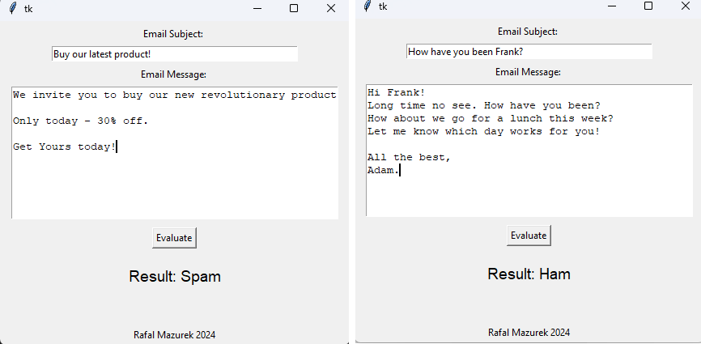

### Spam Detection Personal Project

This project is a spam detection tool bundled with a simple and intuitive GUI. The app allows users to input an email along with its subject, evaluate whether it is likely to be spam or not, and display the result.

### Project Overview

The spam detection tool uses a Multinomial Naive Bayes machine learning model to label emails as spam or ham (meaning not-spam), based on both the subject and the message. The model was trained on a publicly available dataset of labeled emails (credited in the documentation) and can be run on a simple GUI designed with simplicity and ease of use in mind.

### Preview

### Features

* <b>Spam Detection</b>: Classifies a given email as spam or ham.
* <b>Graphical User Interface</b>: User-friendly interface created with Tkinter, allowing non-technical users to take advantage of the tool.
* <b>Self-contained Predictive Functionality</b>: Includes a trained and model with optimized hyperparameters and vectorizer. No need for resource-intensive re-training.

### Documentation

For a detailed explanation of the project, please refer to the documentation.ipynb file. It is a Jupyter notebook that walks through each step of the app development process. This was my first time creating documentation, and I found it to be a valuable learning experience. Any suggestions for improvement are highly appreciated!

### Setup Instructions:

##### Prerequisites

To run this project, please ensure you have the required libraries installed. To do this, simply run this command:

<code>pip install joblib scikit-learn numpy tkinter</code>

##### Running the Application

1. Clone the repository to your local machine:

<code>git clone git@github.com:r-mazurek/spam-detector-project.git</code>

2. Navigate to the project directory

3. Start the application by running the GUI

<code>python app_files/gui.py</code>

##### Example Usage

1. Enter a subject and message in the respective fields.
2. Press Evaluate to see the result displayed below.

### Feedback & Contant Info

Any feedback would be highly appreciated. Please don’t hesitate to contact me.

e-mail: rafalm2404@gmail.com